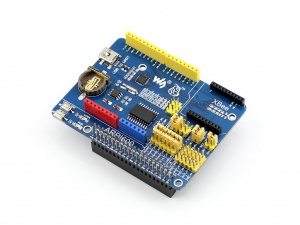
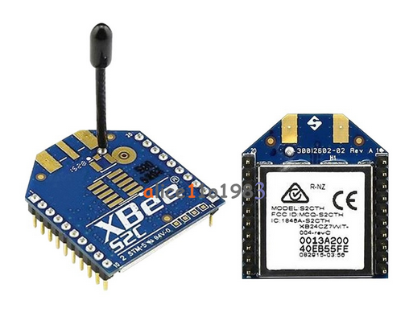
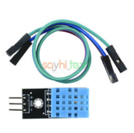
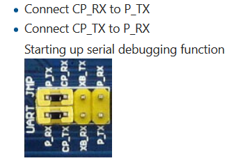
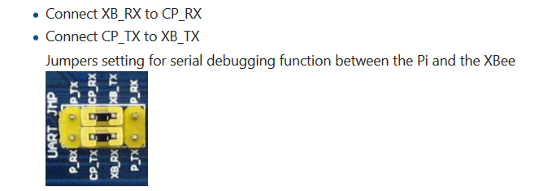
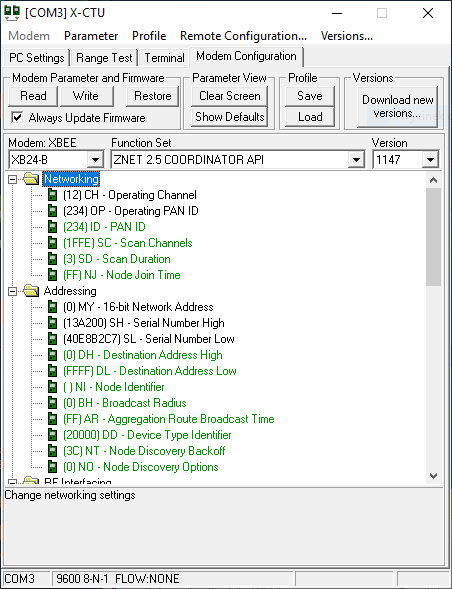
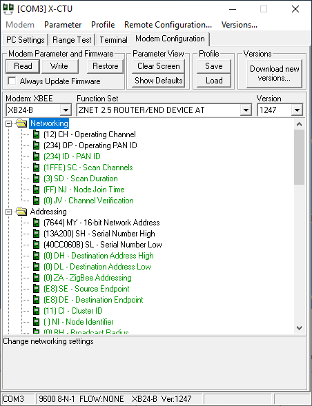
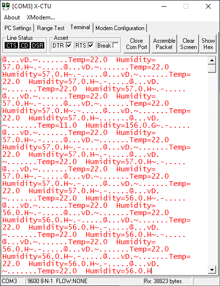

>  # Temparature and humidity controller.
## Table of contents
* [General info](#general-info)
* [Requirements](#requirements)
* [Setup](#setup)

## General info
This project is distributed system for wireless temperature and humidity monitoring using PaspberryPi and XBee modules.
	
## Requirements
System was build with:
* 2 pieces RapsberyPi 3B +

* 2 pieces ARPI600 Expansion Board

* 2 pieces XBee 2mW Wire Antenna - Series 2 (ZigBee Mesh)

* 2 pieces DH11 Temperature & Humidity Sensor

## Setup
1. Configuration of RPis settings and installation of required software and libraries for XBee radio communication.

* The first step is enabling serial port of RaspberryPi to be able to connect using SSH.

* Then next is installing required libraries: GPIO, XBee, and LAMP.

* On the computer that we will use to connect to the RaspberryPi, we must install the USB driver for UART (cp2102 driver) and Digi software to support XBee modules called XCTU.

* In the next step, connect the RPi through the ARPI600 board using a USB cable and set the jumpers on the board as shown on the photo below

* Now we can connect to RPi using SSH.

* Next set up XBee wireless module connections using Digis XCTU tool. First we need to move the jumpers on the board as below

* Configure the XBee 1 module as COORDINATOR:

* Configure the XBee 2 module as END DEVICE:

* test connectivity

		
2. Implementation of necessary scripts to support communication between the coordinating and end device.
	* Scripts for first RPi which is the coordinator
		* pro_coordinator.py
		* pro_web.py - script used for update the measurement results from the end device
		* simple php website for measurements display
	* Scripts for second RPi which is the end device
		* pro_end.py
		* systemctl - autostart settings on the end device